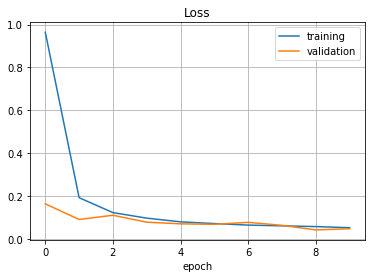
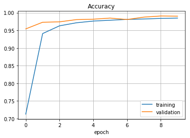
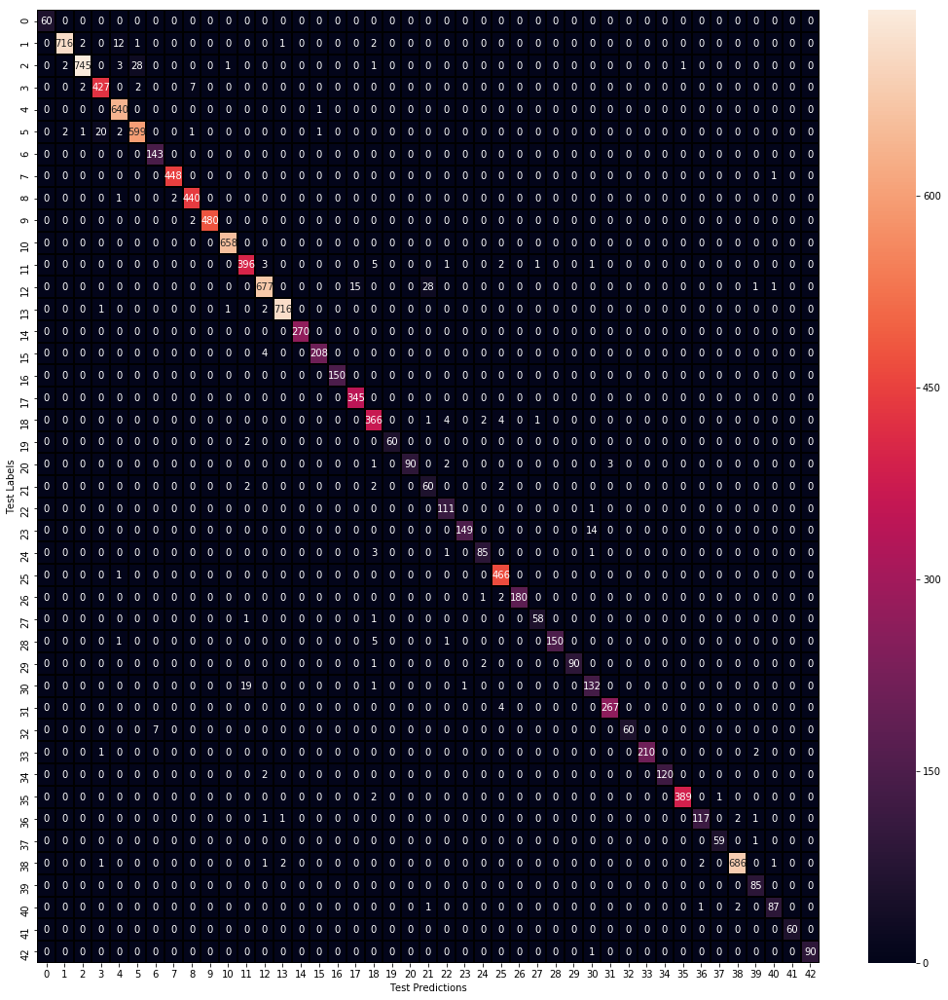

# German Traffic Signs Classification with Keras

German traffic signs dataset is analysed with Keras. This task is a multi-class classification problem and the dataset is complex  because of containing 40 classes with 50000 images. The dataset is splitted into training, validation and test dataset and normalised. Data is preprocessed and data augmentation is applied. The LeNet model is implemented from scratch and trained. At the end of this process, 98%
acurracy is obtained on the test dataset and corresponding plots are shown.

